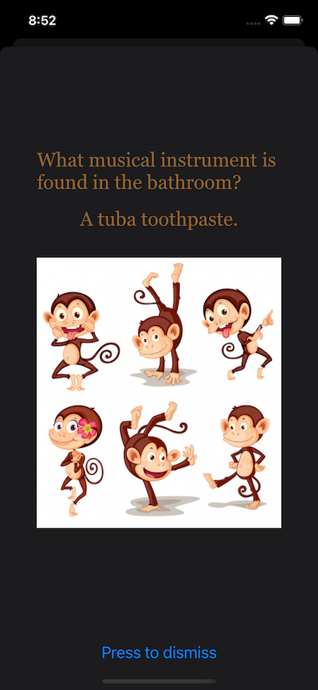
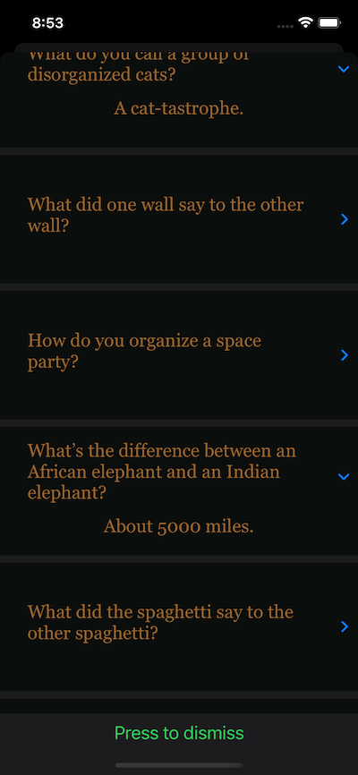

# Jokes

Jokes is a simple SwiftUI app that uses the official-joke-api to display either a random joke or their Top 10 jokes. It uses Combine to download the jokes. The only SwiftUI view it uses beyond the basics are the DisclosureGroups used to display the Top 10 jokes.

 

## License

Jokes is licensed under the Unlicense. See the LICENSE file for more information, but basically this is sample code and you can do whatever you want with it.
